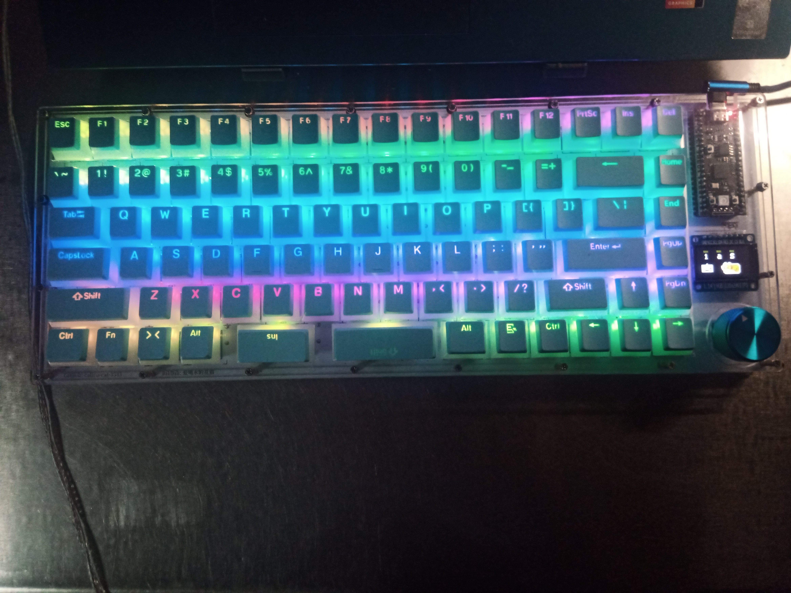

# calicocat-keyboard
使用YD-RP2040（RPI pico兼容开发板）作为主控的键盘，带 RGB、旋钮和小屏幕，支持热插拔，使用kmk固件

code 文件夹中是键盘的固件代码，需要配合 [kmk](http://kmkfw.io/) 使用，并需要 [Adafruit_CircuitPython_NeoPixel](https://github.com/adafruit/Adafruit_CircuitPython_NeoPixel) [Adafruit_CircuitPython_ST7789](https://github.com/adafruit/Adafruit_CircuitPython_ST7789) [Adafruit_CircuitPython_Display_Text](https://github.com/adafruit/Adafruit_CircuitPython_Display_Text) 三个库。

键盘电路图及PCB开源在 [https://oshwhub.com/calico-cat-3333/calicocat-s-keyboard-v1](https://oshwhub.com/calico-cat-3333/calicocat-s-keyboard-v1) 

pcb 文件夹中也提供文件下载，需要使用嘉立创eda打开。

case 文件夹中是外壳的dxf文件。

keyboard-layout.json 是使用 [keyboard layout editor](http://www.keyboard-layout-editor.com) 设计的键位布局

警告：此版本的固件默认超频到 150MHz, 如果您不希望在超频的情况下使用此键盘，您应该注释 `mian.py` 的第 7 行。不过这会导致额外的输入延迟等。

我目前已经使用超频版本固件约半年，未发现严重问题。

## 有用的提示

### 升级CircuitPython

参考[https://docs.circuitpython.org/en/latest/shared-bindings/microcontroller/index.html](https://docs.circuitpython.org/en/latest/shared-bindings/microcontroller/index.html)，可以通过进入REPL后执行以下代码重启到UF2模式以便更新CircuitPython

```python
import microcontroller
microcontroller.on_next_reset(microcontroller.RunMode.UF2)
microcontroller.reset()
```

### 重命名CIRCUITPY驱动器

参考[https://learn.adafruit.com/welcome-to-circuitpython/renaming-circuitpy](https://learn.adafruit.com/welcome-to-circuitpython/renaming-circuitpy)，用以下内容替换boot.py的内容，然后重启开发板/拔下再插入键盘，然后将boot.py恢复到之前的内容。（可以将KMKFW替换为少于11字符的任意内容）

```python
import storage

storage.remount("/", readonly=False)

m = storage.getmount("/")
m.label = "KMKFW"

storage.remount("/", readonly=True)

storage.enable_usb_drive()
```


## 已知问题

在使用此键盘时，会有偶发的键盘突然不停输入最后按下的按键的情况，似乎是按键松开事件没有正确传入电脑。由于此问题发生偶然性很大，我没有找到稳定的复现方法，故暂时无法定位修复。临时的解决方案是在出现此问题时将键盘拔下再重新插入即可。

